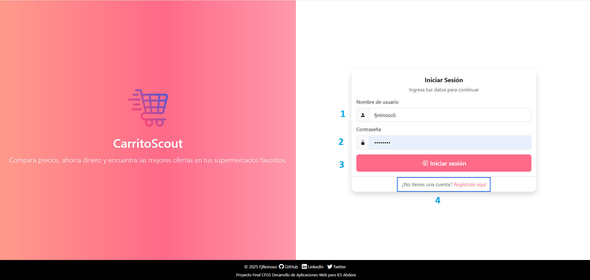

# Manual de Usuario - CarritoScout

## Índice

1. [Introducción](#1-introducción)
2. [Requisitos del Sistema](#2-requisitos-del-sistema)
3. [Acceso a la Aplicación](#3-acceso-a-la-aplicación)
   - [Registro de Usuario](#31-registro-de-usuario)
   - [Inicio de Sesión](#32-inicio-de-sesión)
4. [Página Principal y Navegación](#4-página-principal-y-navegación)
   - [Interfaz General](#41-interfaz-general)
   - [Barra de Navegación](#42-barra-de-navegación)
   - [Modo Oscuro](#43-modo-oscuro)
5. [Exploración de Productos](#5-exploración-de-productos)
   - [Búsqueda de Productos](#51-búsqueda-de-productos)
   - [Filtros Avanzados](#52-filtros-avanzados)
   - [Detalles de Producto](#53-detalles-de-producto)
6. [Gestión de Carritos](#6-gestión-de-carritos)
   - [Crear un Nuevo Carrito](#61-crear-un-nuevo-carrito)
   - [Añadir Productos al Carrito](#62-añadir-productos-al-carrito)
   - [Modificar Cantidades](#63-modificar-cantidades)
   - [Eliminar Productos](#64-eliminar-productos)
   - [Compartir Carritos](#65-compartir-carritos)
   - [Gestionar Múltiples Carritos](#66-gestionar-múltiples-carritos)
7. [Lista de Compras](#7-lista-de-compras)
   - [Generar Lista de Compra](#71-generar-lista-de-compra)
   - [Imprimir Lista](#72-imprimir-lista)
8. [Análisis de Precios](#8-análisis-de-precios)
   - [Evolución de Precios](#81-evolución-de-precios)
   - [Selección Múltiple de Productos](#82-selección-múltiple-de-productos)
   - [Filtros por Supermercados/Categorías](#83-filtros-por-supermercados)
9. [Perfil de Usuario](#9-perfil-de-usuario)
   - [Datos Personales](#91-datos-personales)
   - [Estadísticas y Resumen](#92-estadísticas-y-resumen)
   - [Soporte y Ayuda](#93-soporte-y-ayuda)
10. [Funciones Adicionales](#10-funciones-adicionales)
    - [Notificaciones](#101-notificaciones)
11. [Preguntas Frecuentes](#11-preguntas-frecuentes)
12. [Contacto y Soporte](#12-contacto-y-soporte)

## 1. Introducción

CarritoScout es una aplicación web diseñada para comparar precios de productos frescos y de supermercado entre diferentes establecimientos. La plataforma permite a los usuarios:

- Comparar precios de un mismo producto en diferentes supermercados
- Crear y gestionar carritos de compra personalizados
- Compartir carritos con otros usuarios
- Analizar la evolución histórica de precios
- Generar listas de compra imprimibles
- Ver Los diferentes cátalogos de los supermercados

Este manual proporciona instrucciones detalladas sobre cómo utilizar todas las funcionalidades de CarritoScout, con capturas de pantalla y ejemplos prácticos para optimizar tu experiencia de compra.

## 2. Requisitos del Sistema

Para utilizar CarritoScout de forma óptima, necesitas:

- **Navegadores compatibles**: Google Chrome, Mozilla Firefox, Microsoft Edge o Safari en sus versiones actualizadas
- **Conexión a Internet**: Requerida para todas las funcionalidades
- **Resolución de pantalla**: Mínima recomendada de 1280x720 píxeles o Smartphone
- **JavaScript**: Debe estar habilitado
- **Cookies**: Permitidas para el funcionamiento correcto de la sesión de usuario

La aplicación cuenta con un diseño responsive que se adapta tanto a ordenadores de escritorio como a dispositivos móviles y tabletas, lo que permite consultar precios y gestionar tu carrito desde cualquier lugar.

## 3. Acceso a la Aplicación

### 3.1 Registro de Usuario

Para aprovechar todas las funcionalidades de CarritoScout, debes crear una cuenta de usuario:

1. Desde la página de inicio, haz clic en el botón "Registrarse". Identificador 4 de Inicio de Sesión (más abajo).
2. Se mostrará el formulario de registro con los siguientes campos(Ver formulario en la foto):
   - **Nombre de usuario**: Identificador único para tu cuenta
   - **Correo electrónico**: Necesario para verificación y recuperación de cuenta
   - **Contraseña**: Debe tener al menos 8 caracteres y combinar letras y números
   - **Confirmar contraseña**: Repite la contraseña para verificación
   - **Nombre** y **Apellidos** (opcionales): Para personalizar tu experiencia
3. Haz clic en el botón "Crear cuenta" para completar el registro. Identificador 1
4. Si quiere volver al inicio de sesión pulse 'Inicie sesión aquí'. Identificador 2

La interfaz de registro incluye una sección con información sobre las principales características de CarritoScout:
- Comparación de precios entre supermercados
- Alertas de ofertas personalizadas
- Gestión de listas de compras

### 3.2 Inicio de Sesión

Para acceder a tu cuenta existente:

1. En el panel de inicio de sesión introduce:
   - **Nombre de usuario**: Tu identificador en la plataforma. Identificador 1.
   - **Contraseña**: Tu clave personal de acceso. Identificador 2
2. Haz clic en el botón "Entrar". Identificador 3.

La interfaz de inicio de sesión muestra una imagen de bienvenida en el lado izquierdo con el logo de CarritoScout y una descripción breve de la aplicación.

## 4. Página Principal y Navegación

### 4.1 Interfaz General

Tras iniciar sesión, accederás a la página principal de CarritoScout que consta de:

- **Barra de navegación superior(1)**: Con el logo, menú principal, acceso al carrito y perfil de usuario
- **Seccion bienvenida(2)**: Una sección destacada con el título de bienvenida en gradiente rosa característico
- **Tarjetas de acceso rápido(3,4,5)**: Tres tarjetas principales para acceder a las funciones más importantes:
  - **Busca Productos(3)**: Para explorar el catálogo y comparar precios
  - **Analiza Precios(4)**: Para ver la evolución de precios en el tiempo
  - **Crea Listas de Compras(5)**: Para gestionar carritos personalizados

Las tarjetas presentan un efecto de elevación al pasar el cursor por encima, proporcionando una experiencia interactiva que invita al usuario a explorar las distintas secciones.

### 4.2 Barra de Navegación

La barra de navegación principal está presente en todas las páginas y contiene:

- **Botón de modo oscuro(1)**: En el extremo izquierdo, permite alternar entre tema claro y oscuro
- **Logo y nombre CarritoScout(2)**: En la parte izquierda-central (No hace nada si lo pulsas)
- **Icono de carrito con contador(3)**: Muestra el número de productos en el carrito activo y el nombre del carrito activo
- **Menú principal**: Con acceso a:
  - **Inicio(4)**: Vuelve a la página principal (`<i class="bi bi-house-door"></i>`)
  - **Productos(5)**: Explora el catálogo de productos (`<i class="bi bi-box"></i>`)
  - **Análisis(6)**: Accede a gráficos de evolución de precios (`<i class="bi bi-graph-up"></i>`)
  - **Perfil(7)**: Botón circular con acceso al perfil personal(En escritorio no tiene texto en plataformas moviles sí) (`<i class="bi bi-person-circle"></i>`)
  - **Cerrar sesión(8)**: Botón circular rojo para salir(En escritorio no tiene texto en plataformas moviles sí) (`<i class="bi bi-box-arrow-right"></i>`)

En dispositivos móviles, la navegación se adapta con un menú desplegable y el carrito se muestra como un icono fijo a la derecha para facilitar el acceso.

### 4.3 Modo Oscuro (Experimental)

CarritoScout incluye un modo oscuro que se puede activar desde cualquier página pero su implementación perfecta todavia no se ha llevado a cabo:

1. Haz clic en el botón con el icono de luna (`<i class="bi bi-moon"></i>`) ubicado en la esquina superior izquierda
2. La interfaz cambiará automáticamente a tonos oscuros, usando gradientes y colores adaptados para reducir fatiga visual
3. Para volver al modo claro, haz clic en el icono de sol (`<i class="bi bi-sun"></i>`) que reemplaza al de luna

## 5. Exploración de Productos

### 5.1 Búsqueda de Productos

La sección de productos es accesible desde el menú principal haciendo clic en "Productos". Dentro de esta sección puedes buscar productos de varias maneras:

1. **Exploración por supermercado**: Selecciona uno o varios supermercados para ver sus productos disponibles
   - Los supermercados disponibles incluyen: Mercadona, Carrefour, Día, Lidl, Ahorramas, etc.
   - Se visualizan con sus logos o iconos representativos*

2. **Navegación por categorías**: Usa el panel de filtros desplegable para explorar por tipo de producto
   - Se muestran iconos descriptivos y nombres para cada categoría
   - Incluye categorías como: Alimentación fresca, Alimentación seca, Dulces y aperitivos, Bebidas, Higiene y salud, etc.

3. **Barra de búsqueda, rango de precios y ordenamiento**: Ubicada en el panel de filtros, permite buscar por nombre de producto, rango de precios, supermercado, categoría del producto.S
   - Introduce el texto y presiona el icono de lupa o Enter
   - Los resultados se actualizan automáticamente mostrando coincidencias
La interfaz muestra un contador con el total de resultados y la paginación actual (Ej: "Mostrando 24 de 156 productos (Página 1 de 7)").

### 5.2 Filtros Avanzados

El panel de filtros lateral ofrece múltiples opciones para refinar los resultados:

1. **Filtro de Supermercados**:
   - Selecciona las tarjetas de los supermercados deseados (se resaltarán con un borde rosa)
   - Múltiples selecciones permiten comparar entre establecimientos

2. **Filtro de Categorías**:
   - Organizado por tipos de producto con iconos intuitivos
   - Cada categoría muestra ejemplos de productos incluidos

3. **Otros Filtros**:
   - **Campo de búsqueda**: Para encontrar productos específicos por nombre
   - **Rango de precios**: Establece un precio mínimo y máximo usando controles numéricos
   - **Ordenamiento**: Desplegable con opciones como:
     - Nombre A-Z / Z-A
     - Precio menor a mayor / mayor a menor

4. **Gestión de Filtros**:w
   - Botón "Aplicar Filtros" para actualizar los resultados
   - Botón "Limpiar todos" para reiniciar la búsqueda
   - Panel de "Filtros activos" que muestra etiquetas con los filtros seleccionados

La interfaz incluye un botón flotante "Filtros" que permite mostrar/ocultar el panel lateral, especialmente útil en dispositivos móviles.

### 5.3 Detalles de Producto

Al hacer clic en "Ver detalles" en cualquier producto accederás a su página completa que contiene:

1. **Navegación de migas de pan**: Muestra la ruta desde inicio > productos > [categoría] > [producto actual]

2. **Sección principal del producto**:
   - **Imagen del producto**: A tamaño completo en la columna izquierda
   - **Información detallada**:
     - Título y categoría del producto
     - Rango de precios con mínimo y máximo
     - Disponibilidad en supermercados
     - Descripción
     - Unidad de medida

3. **Comparativa de precios**:
   - Listado de cada producto con un supermercado con su precio actual
   - Botón para añadir al carrito desde cada supermercado
   - Indicación visual del supermercado más económico

4. **Productos relacionados**:
   - Sugerencias de productos similares (Siempre se cogerán productos que sean de similar categoría sin incluir el que se está mostrando.)

Esta vista detallada permite comparar precios de un mismo producto en diferentes establecimientos y analizar su evolución histórica antes de decidir la compra.

## 6. Gestión de Carritos

La gestión de carritos está organizada en pestañas, facilitando el acceso a todas las funcionalidades relacionadas con tus compras.

### 6.1 Crear un Nuevo Carrito

Para crear un carrito personalizado:

1. Accede a la sección de carritos dandole al badge de carritos con el número en el centro de la barra de navegación o desde el panel principal en su atajo. 
Haz clic en el botón "Crear Nuevo Carrito" (rosa con un icono de carrito + plus)
3. En el modal que aparece, completa:
   - **Nombre del carrito**: Un nombre descriptivo (ej. "Compra Semanal", "Despensa", etc.)
   - Marca la opción "Establecer como carrito activo" si deseas que sea tu carrito predeterminado
4. Presiona "Crear carrito"

El sistema puede crear automáticamente un carrito si intentas añadir un producto sin tener ninguno activo.

### 6.2 Añadir Productos al Carrito

Para añadir un producto, tenemos que ir a la pestaña productos, entrar en los detalles de estos y desde ahi podemos añadir el producto que queramos al carrito activo actual.

Al añadir un producto, aparece una notificación temporal en la esquina superior derecha confirmando la acción.

### 6.3 Modificar Cantidades

Para ajustar la cantidad de un producto en el carrito:

1. Accede a la pestaña "Carrito Activo"
2. Busca el producto que deseas modificar
3. Utiliza:
   - Botón "-" para disminuir la cantidad
   - Campo numérico central para introducir un valor específico
   - Botón "+" para aumentar la cantidad
4. Las modificaciones se guardan automáticamente
5. El precio total y subtotales se actualizan en tiempo real

### 6.4 Eliminar Productos

Para quitar un producto del carrito:

1. En la pestaña del carrito activo, localiza el producto a eliminar
2. Haz clic en el botón con icono de papelera (rojo) a la derecha del producto
3. El producto se eliminará inmediatamente despues de pulsar en la alerta si desea eliminarlo.

### 6.5 Compartir Carritos

CarritoScout permite colaborar con otros usuarios compartiendo carritos:

1. Desde la pestaña "Carrito Activo", localiza el botón "Invitar usuario".
2. Haz clic en "Invitar usuario"
3. En el formulario emergente introduce:
   - Correo electrónico (¡tiene que ser exacto o no le llegara!)
4. Confirma con "Enviar invitación"
5. El destinatario encontrará la invitación en la pestaña "Invitaciones" y podrá aceptarla o rechazarla. (cabe destacar que si no le ha llegado la invitación tendrá que refrescar la página.)

Una vez que un usuario se ha invitado en la pestaña carrito activo pasará de tener nombre +`(invitado) a nombre+(compartido).

El funcionamiento del carrito compartido es similar a uno individual, ambos pueden añadir y eliminar productos, alterar cantidades o generar la lista de la compra.

Pero solo el dueño podrá eliminar el carrito. Un carrito compartido puede existir sin estar activo.

### 6.6 Gestionar Múltiples Carritos

La pestaña "Todos los Carritos" permite gestionar varios carritos simultáneamente:

1. Accede a la pestaña para ver el listado completo de tus carritos
2. Para cada carrito puedes:
   - **Activar**: Establecerlo como carrito principal con el botón "Activar"
   - **Eliminar**: Borrarlo permanentemente con el botón de papelera

Cada carrito muestra:
- Nombre identificativo
- Número de productos y precio total acumulado.
- Fecha de creación 
- Indicador de si está compartido con otros usuarios

No se puede eliminar todos los carritos, siempre existirá uno activo, solo como excepción cuando creas una cuenta por primera vez. Al hacer cambios del carrito te redirigirá a la pestaña Carrito Activo siempre.

El resto de pestañas, Estadísticas simplemente está preparada para desarrollos futuros, con algunos datos interesantes.

La pestaña Invitaciones es donde recibiremos las notificaciones de que alguien desea invitarnos a un carrito compartido.

## 7. Lista de Compras

La funcionalidad de lista de compras te permite convertir tu carrito en un formato práctico para realizar tus compras físicamente.

### 7.1 Generar Lista de Compra

Para obtener una lista de compra organizada:

1. En la vista de "Carrito Activo", localiza la sección de acciones
2. Haz clic en el botón "Generar Lista de Compra" (icono de lista)
3. Se abrirá una ventana modal mostrando tu lista optimizada y se pueden tachar! (aunque no se guarda durante ejecuciones... por ahora)
4. Los productos aparecerán organizados por categorías para facilitar tu recorrido por el supermercado
5. Cada ítem incluye:
   - Casilla de verificación para marcar productos ya adquiridos
   - Nombre del producto
   - Cantidad necesaria

### 7.2 Imprimir Lista

Para imprimir tu lista de compras:

1. Desde la vista de lista de compra, haz clic en "Imprimir"
2. Se abrirá el diálogo de impresión de tu navegador
3. Configura las opciones de impresión según tus preferencias
4. Haz clic en "Imprimir"

También puedes guardar la lista como PDF seleccionando la opción correspondiente en el diálogo de impresión.

## 8. Análisis de Precios

La sección de análisis de precios proporciona herramientas visuales para entender las tendencias de precios y tomar decisiones de compra informadas.

### 8.1 Evolución de Precios

Para analizar cómo cambian los precios a lo largo del tiempo:

1. Accede a la sección "Análisis" desde el menú principal (icono de gráfico)
2. En la interfaz de "Evolución de Precios":
   - Selecciona el tipo de análisis: producto, categoría o supermercado
   - Utiliza el campo de búsqueda autocompletable para encontrar productos específicos o selecciona las demás categorias para supermercados y categorías.
   - El historial actualmente es mes a mes, y coge todos los datos disponibles.
   - El gráfico se actualizará automáticamente mostrando la evolución temporal

El gráfico interactivo muestra líneas de diferentes colores para cada supermercado, facilitando la comparación visual entre establecimientos.

### 8.2 Selección Múltiple de Productos

Para comparar la evolución de precios de varios productos simultáneamente:

1. Utiliza el buscador para encontrar un producto
2. Haz clic en "Añadir"
3. El producto se añadirá como una etiqueta en la sección "Productos seleccionados"
4. Repite el proceso para añadir más productos (Los productos añadidos no desaparecen del listado)
5. Para eliminar un producto de la comparación, haz clic en la "X" en su etiqueta

Esta funcionalidad es especialmente útil para comparar productos similares o complementarios.

### 8.3 Filtros por Supermercados/Categorías

Para personalizar la visualización por establecimientos:

1. Utiliza los selectores de supermercado para filtrar los datos mostrados
2. Marca o desmarca los supermercados según tus preferencias
3. El gráfico se actualizará dinámicamente mostrando solo los datos de los supermercados seleccionados

El funcionamiento es similar para las categorías.

## 9. Perfil de Usuario

La sección de perfil te permite gestionar tu información personal y acceder a estadísticas de uso.

### 9.1 Datos Personales

El perfil de usuario está organizado en pestañas para facilitar la navegación:

1. Accede a tu perfil haciendo clic en el botón circular con icono de usuario en la barra de navegación
2. En la sección "Mi Perfil" (pestaña activa por defecto) encontrarás:
   - **Datos Personales**: Formulario con tu información básica (nombre, apellidos, email)

Para actualizar tus datos:
1. Modifica los campos deseados en el formulario
2. Haz clic en "Guardar cambios"
3. Aparecerá una notificación confirmando que los cambios se han guardado correctamente

Como limitaciones, la información adicional es totalmente opcional, y el nombre de usuario no se puede eliminar, además de esto el email tampoco aparece ya que es la clave identificadora única de cada usuario.

Para modificar la contraseña, simplemente añada la contraseña inicial y la nueva contraseña siempre cumpliendo con las restricciones de generación de contraseña y las diferentes validaciones. 
### 9.2 Estadísticas y Resumen

La pestaña "Estadísticas y Resumen" proporciona información sobre tu actividad:

Pero esta pestaña está en desarrollo actualmente.

### 9.3 Soporte y Ayuda

La tercera pestaña del perfil está dedicada a ayuda y soporte:

Pero esta pestaña está en desarrollo actualmente.

## 10. Funciones Adicionales

### 10.1 Notificaciones

CarritoScout incluye un sistema de notificaciones para mantenerle informado sobre diversas acciones:

Estas principalmente son durante la manipulación de productos (añadir y eliminar) y la manipulación de carritos(idem).

Las notificaciones aparecen como mensajes temporales en la esquina superior derecha de la pantalla y utilizan un código de colores para distinguir entre:
- Verde: Acciones exitosas y confirmaciones
- Rojo: Errores o problemas
- Amarillo: Advertencias e información importante

## 11. Preguntas Frecuentes

**P: ¿Puedo utilizar CarritoScout sin registrarme?**
R: Es necesario registrarse para acceder a todas las funcionalidades. El registro es gratuito y sólo requiere un correo electrónico válido.

**P: ¿Cómo se actualizan los precios de los productos?**
R: Ahora mismo los productos están cargados con dos script de python uno para los productos con precios imaginarios, y otro para añadir más precios históricos imaginarios.

**P: ¿Puedo tener más de un carrito activo?**
R: Sólo puedes tener un carrito activo a la vez, pero puedes crear múltiples carritos y alternar entre ellos fácilmente desde la sección "Todos los Carritos".

**P: ¿Puedo usar CarritoScout en mi dispositivo móvil?**
R: Sí, la aplicación está diseñada con un diseño responsive que se adapta a cualquier tamaño de pantalla, incluyendo smartphones y tablets aunque para una experiencia más completa recomendamos la versión de escritorio.

**P: ¿Cómo funciona el modo oscuro?**
R: Puedes activar el modo oscuro haciendo clic en el icono de luna en la barra de navegación. Esta configuración se guardará para futuras sesiones.

## 12. Contacto y Soporte

Para obtener asistencia adicional con CarritoScout:

- **Redes sociales**: Sígue al desarrollador en GitHub, LinkedIn y Twitter (enlaces en el pie de página)
- **Proyecto educativo**: Este es un proyecto final para el CFGS Desarrollo de Aplicaciones Web del IES Abdera
- **Por correo**: ìfjreinoso@gmail.com
- GitHub: [github.com/FjReinoso/CarritoScout](https://github.com/FjReinoso/CarritoScout)

---

*Este manual ha sido desarrollado como parte del Proyecto Final del Ciclo Formativo de Grado Superior en Desarrollo de Aplicaciones Web (CFGS DAW) para IES Abdera.*

*Autor: Francisco José García Reinoso*  
*Versión: 1.0 - Junio 2025*

